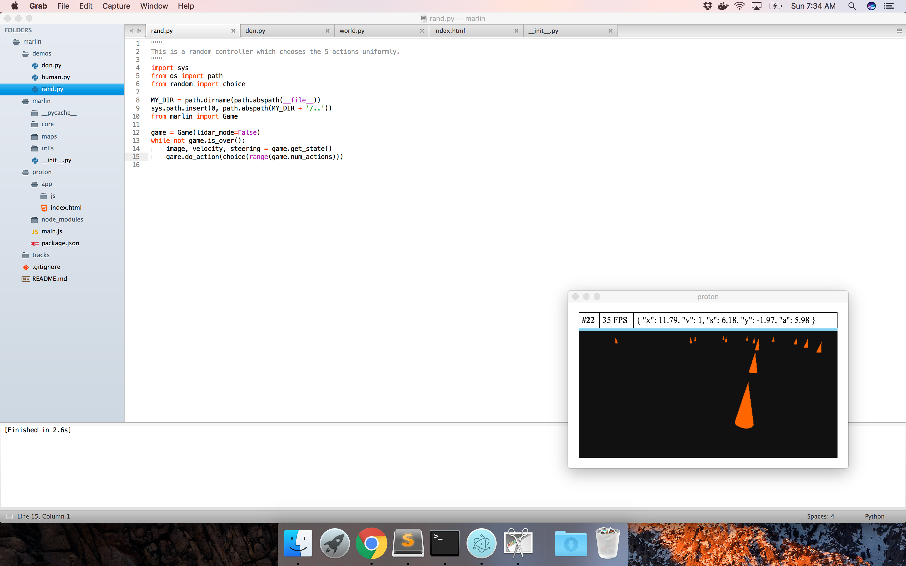

# marlin
This is the "Multistage Autonomous Reinforcement Learning for Intelligent Navigation" project, also
known as MARLIN. Fun fact, the marlin is one of the fastest fish in the world and as such, the name
of this project is not only extremely convoluted but also misleading.



The `marlin` package is based on `konics` but provides a reinforcement learning interface which can
easily be extended to be used with a variety of RL libraries and algorithms. If you need help with 
running `marlin`, check out: https://www.youtube.com/watch?v=noQkK8I0wEc.

## usage
```
import random
from marlin import Game

NOTHING = 0
STEER_LEFT = 1
STEER_RIGHT = 2
SPEED_UP = 3
SLOW_DOWN = 4
ACTIONS = [NOTHING, STEER_LEFT, STEER_RIGHT, SPEED_UP, SLOW_DOWN]

game = Game(lidar_mode=False)
while not game.is_over():
    image, velocity, steering = game.get_state()
    game.do_action(random.choice(ACTIONS))
```
